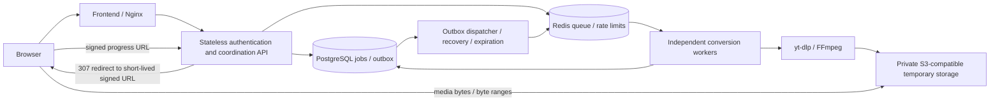

# YouTube media conversion — distributed architecture

Implements the architecture pattern in the supplied Y2Mate/EtaCloud observations
using our own services and credentials. It does not call EtaCloud or claim to reproduce
its unverified private internals.



The API does no conversion and proxies no media bytes. Workers scale independently.
The test UI retains MP3/MP4 selection, audio/video preview, cancellation, and completion
stats. Use content you own or have permission to download.

## Run the full stack locally

Requires Docker with Compose. The first build downloads images and Python packages.

```sh
python3 scripts/init-distributed-env.py
docker compose --env-file .env.distributed up -d --build --scale worker=2
```

Open **http://localhost:8000**. S3 downloads use http://localhost:19000. Both ports bind
only to loopback. Redis and PostgreSQL are not exposed to the host. If another process
uses port 8000, stop it or start this stack with `APP_PORT=8010` before the Docker command.

The initialization script generates random secrets into gitignored `.env.distributed`
with owner-only permissions. It never prints secrets. Local demo sessions allow anonymous
authentication via `DEV_ALLOW_ANONYMOUS=true`; protected deployments must set this to
`false`. In protected mode the test UI asks for `CLIENT_API_KEY`; the key is sent in a
POST body, never in a URL or bundled JavaScript. Keep `SIGNING_SECRET` stable across
replicas/restarts or existing signed URLs will stop working.

Services:

| Service | Responsibility |
| --- | --- |
| `frontend` | Static UI and reverse proxy; capability query strings are not logged |
| `api` | Authentication, signed initialization, job admission, progress, download redirects |
| `postgres` | Authoritative job state, durable pending-job records, worker attempt ownership, stats |
| `redis` | Work notifications and atomic rate-limit counters; AOF enabled |
| `dispatcher` | Relay durable queued jobs, recover expired leases, delete expired objects/records |
| `worker` | One concurrent conversion per replica, subprocess timeouts, upload to object storage |
| `storage` | SeaweedFS local S3 service; private objects, signed downloads, persistent volume |
| `setup` | Versioned schema upgrades, bucket initialization and lifecycle configuration |

The lightweight API image excludes yt-dlp, FFmpeg, and Node. The worker image contains
them. Python dependencies are pinned separately in `requirements-api.lock` and
`requirements-distributed.lock`. Rebuild after source changes.

## Signed request flow

1. `POST /api/v1/auth` with `{"api_key":"..."}` → a signed session `key` valid for 15 minutes.
   In production anonymous mode or the local anonymous demo, send `{}`.
2. `POST /api/v1/init` with `Authorization: Bearer <key>` and a validated conversion
   body → `convertURL`, signed for 2 minutes and bound to that exact URL/format/bitrate.
3. `POST <convertURL>` → HTTP 202 with `id`, `progressURL`, `downloadURL`, `previewURL`,
   `cancelURL`, `deleteURL`, and `jobToken`. Retrying the same conversion URL returns
   the same job. It does not enqueue another conversion.
4. Poll `GET <progressURL>` until `status` is `completed` (or `failed`/`cancelled`).
   Stages describe actual work; `progress` is null until completion and then 100,
   rather than presenting invented percentages during encoding.
5. `GET <downloadURL>` → HTTP 307 redirect to a private-object S3 presigned URL valid
   for at most 5 minutes and never beyond the job's expiry. File bytes and range
   requests go directly to object storage, not through the API.

Example initialization body:

```json
{"url":"https://www.youtube.com/watch?v=YOUR_VIDEO_ID","format":"mp4","bitrate":192}
```

`format` is `mp3` or `mp4`; bitrate applies to MP3 only. MP4 is H.264/yuv420p plus
AAC-LC stereo at 48 kHz, up to 720p. MP4 uses FFmpeg/libx264 with the
`veryfast` preset, CRF 28, and 128 kbps AAC for fast compression. This is lossy;
size savings depend on the source, and already compact videos may not shrink. MP4 audio is explicitly decoded before publishing.
Deleted-job conversion replays return 410 while the original grant remains valid.
Job capabilities are checked against database expiry, including after extended recovery.
The job token allows progress/download/cancel/delete only for its specific job;
session, conversion, and job tokens use distinct signing purposes.

Use POST for auth and conversion mutations. This intentionally improves upon the
observed GET-based flow, which can leak credentials in URLs or trigger work from crawlers.
URLs are bearer capabilities: don't share them or log their signatures. Referrer policy
is `no-referrer`. The page stores only its job token in the address bar for refresh recovery;
long-lived API keys stay in memory.

## Reliability and limits

- PostgreSQL commits the queued job before responding. The queued row and its publish
  deadline form a transactional outbox; Redis outages do not erase accepted work.
- Dispatcher messages are at-least-once. A transactional job claim prevents duplicate
  processing while the current worker's lease is valid.
- Workers renew leases and monitor cancellation. Lease recovery assigns a new attempt
  token; completion updates are fenced so stale workers cannot replace newer results.
- Unexpected infrastructure failures retry through lease recovery, bounded by
  `MAX_JOB_ATTEMPTS`. Invalid/unavailable content fails without endless retries.
- Worker outputs use attempt-specific object keys. Failed/stale attempts delete their
  own object. Object lifecycle is a retention-aware backstop for crash-orphaned uploads.
- Exact result TTL is enforced by the API and the dispatcher. Cleanup retries on storage
  failure. Native S3 downloads support repeat requests and seeking.
- API admission is globally serialized through a short PostgreSQL row lock; retained
  jobs count toward the storage cap. Redis rate-limit increments/expiry are atomic.
- Graceful cancellation kills the media subprocess group. Its parent watchdog handles
  worker process death. Local temp files use each container's writable disk; provision host disk quotas.
  Workers handle SIGTERM through cancellation cleanup with a 150-second container grace period.

## Configuration

The generated `.env.distributed` supplies Compose interpolation via `--env-file`.
Compose passes each service explicit settings; API signing secrets are not injected into
workers, dispatcher or setup. Production role overrides are described in
[production operations](docs/production.md).

| Variable | Purpose / default |
| --- | --- |
| `DATABASE_URL`, `REDIS_URL` | Shared PostgreSQL / Redis endpoints |
| `SIGNING_SECRET` | At least 32 characters; shared by all API replicas |
| `CLIENT_API_KEY` | At least 32 characters for protected test-client access |
| `DEV_ALLOW_ANONYMOUS` | `true` only in the generated local demo |
| `S3_ENDPOINT` | Worker/setup internal object-storage endpoint |
| `S3_PUBLIC_ENDPOINT` | Browser-reachable S3 endpoint used for signatures |
| `S3_BUCKET`, `S3_REGION` | Temporary private bucket and region |
| `S3_ACCESS_KEY`, `S3_SECRET_KEY` | Object-storage credentials; use scoped production credentials |
| `CONVERSION_API_BASE` | Optional origin for a separate conversion API deployment |
| `CORS_ORIGINS` | Explicit allowed frontend origins when services use separate domains |
| `JOB_RETENTION_SECONDS` | `3600` after terminal status |
| `MAX_STORED_JOBS` | `100` across queued, active, and retained jobs |
| `JOBS_PER_MINUTE` | `10` per authenticated client |
| `MAX_QUEUE_WAIT_SECONDS` | `900` |
| `WORKER_LEASE_SECONDS` | `60`, renewed at most every 2 seconds |
| `MAX_JOB_ATTEMPTS` | `3` |
| `CONVERSION_TIMEOUT_SECONDS` | `600`; upload/coordination gets up to 120 additional seconds |
| `MAX_DURATION_SECONDS` | `1800` |
| `MAX_DOWNLOAD_MB`, `MAX_OUTPUT_MB` | `512` each (MiB) |

Completion stats include queue wait, download/processing/upload time, total time, CPU,
peak individual process RAM, sampled temporary disk, source bytes, and output bytes.
Stats describe server work, excluding transfer to the browser. RAM is not the sum of
simultaneously running processes, and disk sampling may miss short-lived peaks.

## Scaling and production deployment

Scale workers independently:

```sh
docker compose --env-file .env.distributed up -d --scale worker=4 --scale api=2
docker compose --env-file .env.distributed restart frontend
```

Nginx resolves API replicas when it starts. A managed load balancer or Kubernetes
Service should handle dynamic API discovery in a production deployment. Each worker
process handles one job, so worker replicas define conversion concurrency.

A queue-based Kubernetes/KEDA worker autoscaling example is in
[deploy/worker-autoscaling.yaml](deploy/worker-autoscaling.yaml). It needs your built
worker image, cluster secrets, and shared database/Redis/S3 services; it is not deployed
by Docker Compose. Autoscaling is infrastructure-dependent, not enabled on this Mac.

For the public release, set `APP_ENV=production`, `AUTH_MODE=anonymous`, and
`DEV_ALLOW_ANONYMOUS=false`. No login is required. See [production anonymous access](docs/production.md)
for per-network limits and trusted proxy setup. Identity mode remains optional. Terminate TLS at your edge, use scoped
storage credentials and durable managed PostgreSQL/Redis, and configure resource budgets
and monitoring. The included UI automatically requests anonymous sessions and hides
the API-key field in anonymous mode. Do not distribute a shared internal API key to visitors.

The S3 backend removes API bandwidth load today. A managed CDN can be added in front of
private storage with that provider's signed-URL/origin-access mechanism. No paid CDN,
cloud resources, geographic routing, or public deployment is created by this repository.
Do not replace an S3 presigned hostname with an arbitrary CDN hostname; signatures bind
to the request host. Use provider-correct CDN signing when enabling that layer.

The supplied source observations explicitly leave Y2Mate's actual storage/CDN/queue
implementation unknown. This project implements the stated architecture pattern rather
than attempting to reuse or bypass a third-party service's authorization.

## Test and operate

```sh
pip install -r requirements-dev.txt
pytest -q
# Optional live test: downloads and validates both formats using a short permitted video.
python scripts/smoke-distributed.py --url 'https://www.youtube.com/watch?v=YOUR_VIDEO_ID'
docker compose --env-file .env.distributed ps
docker compose --env-file .env.distributed logs --tail=100 api dispatcher worker
```

Unit/integration tests cover token expiry/tampering/purpose isolation, auth/rate limits,
signed flow, durable outbox retry, duplicate claims, stale-worker fencing, expiration,
S3 redirects, and the existing real FFmpeg media tests. The local suite uses SQLite for
repository logic tests; live stack checks exercise real PostgreSQL/Redis/S3 separately.

Use `docker compose --env-file .env.distributed down` to stop services while preserving
volumes. Adding `-v` destroys job records and stored outputs. Setup applies the versioned
SQL migrations before services start. Existing deployments must follow the maintenance
upgrade procedure in [production operations](docs/production.md); do not mix old and new
admission/cleanup implementations during this upgrade.

The previous embedded single-host mode remains available with
`uvicorn app.main:app --port 8000`; its details are in [docs/local-mode.md](docs/local-mode.md).
It uses separate SQLite/local-file storage and does not migrate old local jobs into the
distributed database.

References: [S3 presigned URLs](https://docs.aws.amazon.com/boto3/latest/guide/s3-presigned-urls.html),
[SeaweedFS S3 quick start](https://github.com/seaweedfs/seaweedfs/wiki/Quick-Start-with-weed-mini).

## Backend audit

See [the backend production-readiness audit](BACKEND_CODE_AUDIT.md) for confirmed findings,
completed cleanup, verification limits, and prioritized production release gates.

## Development standards

Follow [the backend engineering standards](docs/coding-standards.md) for Python style,
API contracts, database changes, worker reliability, security, testing and review.
[Contributor instructions](AGENTS.md) provide the repository working rules.

## Production changes and upgrade procedure

See [production operations](docs/production.md) for schema revision 2, identity exchange
and revocation, proxy trust, service credentials, lifecycle settings, shutdown, backups
and real-service tests. These changes require the documented migration before deployment.
